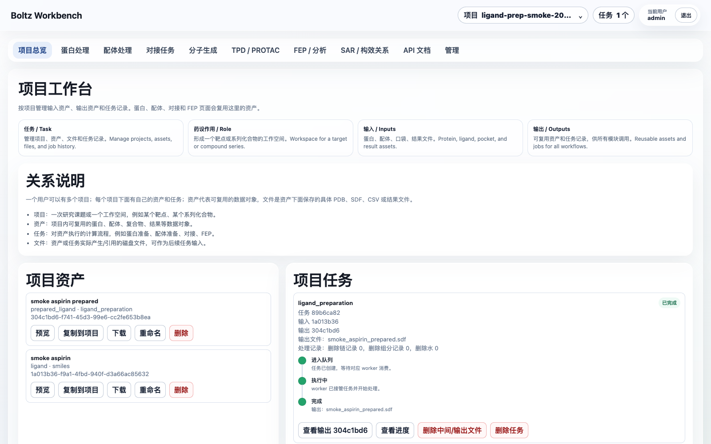

# Boltz WebApp



## 中文说明

Boltz WebApp 是 Boltz 的 ictrek 工作分支，用于在浏览器中完成 CADD 工作流里的蛋白准备、配体准备、口袋定义、任务跟踪、文件管理和 Boltz 输入生成。上游 Boltz 原始说明保留在 [README.origin.md](README.origin.md)。

### 功能分类

- 项目与资产：按用户隔离项目、资产、任务和文件；资产支持预览、下载、重命名、删除和复制到其他项目。
- 蛋白处理：支持 PDB ID 导入、本地 PDB 上传、3D 预览、链/组分/配体/金属/水对象管理、口袋定义、准备后蛋白资产输出。
- 配体处理：支持空白配体库、SMILES/SDF 导入、单分子编辑、Ketcher 2D 编辑、配体准备 worker、Boltz `input.yaml` 生成。
- 对接任务：组合 prepared protein、ligand/prepared ligand 和 pocket，创建可追踪任务并复用输出资产。
- 分子生成：预留基于 pocket asset 的三维分子生成入口。
- TPD / PROTAC：预留 POI、E3、warhead、E3 ligand 和 linker 的降解剂设计入口。
- FEP / 分析：预留自由能计算、轨迹检查、误差分析和报告入口。
- SAR / 构效关系：预留活性表、R-group、MMPA 和下一轮设计入口。
- 管理：管理员审核用户、查看全局任务、停止/清理/删除任务、查看机器资源。
- API 文档：页面内读取 FastAPI OpenAPI，自动展示接口目录和 `asset_id` / `job_id` 工作流衔接方式。

### 交互结构

全局顶部只承载应用标题、项目上下文、任务中心、用户和退出。项目切换、新建、删除收进右上角项目菜单；任务进度收进任务中心，按步骤时间线显示，不在顶部铺绿色状态条。

每个业务模块按 CADD 操作流分层：

- 左侧：输入、参数、资产选择和提交动作。
- 右侧：主工作区、3D/2D 预览、编辑器、输出检查和下载入口。
- 需要大画布的功能，例如蛋白 3D 操作和 Ketcher 2D 分子编辑，提供专注编辑模式，可弹出为独立全屏窗口，完成后退出回到工作台。

### 持久化路径与跨容器文件约定

所有业务容器必须把同一个宿主机目录挂载到容器内 `/data`：

```text
宿主机：${BOLTZ_DATA_HOST_DIR}
容器内：/data
```

生产环境示例：

```bash
BOLTZ_DATA_HOST_DIR=/data/ssd/jhu/boltz-web/data
```

web、protein-prep worker、ligand-prep worker 和后续模型 worker 都必须使用相同的容器内路径：

```text
/data/users/<user_id>/projects/<project_id>/assets/<asset_id>/...
/data/model-cache/...
```

数据库 `AssetFile.storage_path` 只记录容器内 `/data/...` 路径，不记录宿主机路径。这样 web 上传、worker 读取、worker 输出、web 下载和跨任务复用都使用同一套路径，不会因为不同容器看到不同目录而混乱。

`/modelhub` 是只读共享模型目录，不用于用户项目输入/输出文件。

### 默认账户

```text
username: admin
password: admin123456
```

新用户可以在登录页提交注册申请，必须由管理员审核后才能使用。后续接入 VOS 账户时，可通过受 `BOLTZ_USER_PROVISION_TOKEN` 保护的接口自动创建用户空间。

### 独立 Docker 部署

复制环境变量模板：

```bash
cp .env.web.example .env.web
```

编辑 `.env.web`，至少设置：

```bash
PGV_POSTGRES_IMAGE=<pgv-postgres-image>
BOLTZ_DATA_HOST_DIR=/data/ssd/jhu/boltz-web/data
BOLTZ_WEB_PORT=8800
```

启动 web、Postgres 和 Redis：

```bash
docker compose --env-file .env.web -f docker-compose.web.yml up -d
```

启动 CPU 蛋白准备和配体准备 worker：

```bash
docker compose --env-file .env.web \
  -f docker-compose.web.yml \
  -f docker-compose.protein-prep.arm.yml \
  -f docker-compose.ligand-prep.arm.yml \
  --profile protein-prep --profile ligand-prep \
  up -d
```

AMD/x86_64 部署使用 `.amd.yml` overlay；ARM/aarch64 部署使用 `.arm.yml` overlay。

### 镜像构建与标签

镜像名保持组件名，平台和日期放在 tag：

```text
swr.cn-east-3.myhuaweicloud.com/huluxiaohuowa/boltz-web:arm_YYYYMMDD
swr.cn-east-3.myhuaweicloud.com/huluxiaohuowa/boltz-protein-prep:arm_YYYYMMDD
swr.cn-east-3.myhuaweicloud.com/huluxiaohuowa/boltz-ligand-prep:arm_YYYYMMDD
```

CPU-only 镜像只使用 `amd_YYYYMMDD` 或 `arm_YYYYMMDD`。`thor_YYYYMMDD` 只保留给未来需要 GPU/CUDA 的模型运行镜像。

构建示例：

```bash
./build_image.sh --component web --tag arm_YYYYMMDD
./build_image.sh --component protein-prep-arm --tag arm_YYYYMMDD
./build_image.sh --component ligand-prep-arm --tag arm_YYYYMMDD
```

配体准备 worker 是生产配体准备路径，包含 RDKit、OpenBabel、Meeko、Dimorphite-DL 和 gemmi。web 镜像只负责 UI、API 和任务编排，不承担重型化学处理。

### 模型缓存

Boltz 模型文件应下载到持久化目录：

```text
/data/model-cache
```

推荐使用 ModelScope 镜像：

```bash
pip install modelscope
modelscope download \
  --model huluxiaohuowa/boltz-2-mirror \
  --local_dir /data/ssd/jhu/boltz-web/data/model-cache
```

预期包含：

- `boltz2_conf.ckpt`
- `boltz2_aff.ckpt`
- `mols.tar`

### API 自动化

标准 API 契约由 FastAPI 自动生成：

- `/openapi.json`
- `/docs`
- `/redoc`

网页内的 API 文档页面也会读取 `/openapi.json`。自动化工作流按 `project_id`、`asset_id`、`job_id` 串联：

```text
login
  -> project_id
  -> protein asset_id
  -> pocket asset_id
  -> ligand asset_id
  -> prepared_ligand asset_id
  -> boltz_prediction_input asset_id
  -> job_id
  -> output_asset_ids
  -> file download
```

### 使用指南

模块级使用指南在 [userguide](userguide)：

- [项目与资产](userguide/project-and-assets.md)
- [蛋白处理](userguide/protein-preparation.md)
- [1A2C 蛋白准备示例](userguide/1A2C-protein-preparation.md)
- [配体处理](userguide/ligand-preparation.md)
- [配体准备功能框架](userguide/ligand-preparation-research-and-framework.md)
- [对接任务](userguide/docking-tasks.md)
- [分子生成](userguide/molecule-generation.md)
- [TPD / PROTAC](userguide/tpd-protac.md)
- [FEP 与分析](userguide/fep-analysis.md)
- [SAR / 构效关系](userguide/sar.md)
- [管理](userguide/admin.md)
- [API 自动化](userguide/api-automation.md)

### VOS 打包

VOS 包模板位于 `ictrek.app/`，当前独立 WebApp 开发不依赖 VOS：

```bash
cd ictrek.app
./scripts/package.sh
```

## English Guide

Boltz WebApp is the ictrek working fork of Boltz. It provides a browser-based CADD workbench for protein preparation, ligand preparation, pocket definition, task tracking, file management, and Boltz-ready input generation. The upstream Boltz README is preserved in [README.origin.md](README.origin.md).

### Feature categories

- Projects and assets: isolate projects, assets, jobs, and files per user; assets can be previewed, downloaded, renamed, deleted, and copied to another project.
- Protein preparation: import by PDB ID, upload local PDB files, inspect structures in 3D, manage chains/components/ligands/metals/waters, define pockets, and create prepared-protein assets.
- Ligand preparation: create empty ligand libraries, import SMILES/SDF, edit single molecules, use Ketcher 2D editing, run the ligand-prep worker, and generate Boltz `input.yaml`.
- Docking tasks: combine prepared proteins, ligand/prepared-ligand assets, and pockets into traceable jobs with reusable outputs.
- Molecule generation: reserved entry for pocket-conditioned 3D molecule generation.
- TPD / PROTAC: reserved entry for POI, E3, warhead, E3 ligand, and linker workflows.
- FEP / analysis: reserved entry for free-energy calculations, trajectory checks, uncertainty analysis, and reports.
- SAR: reserved entry for activity tables, R-group views, MMPA, and next-design decisions.
- Admin: approve users, inspect global jobs, cancel/cleanup/delete tasks, and monitor host resources.
- API docs: read FastAPI OpenAPI in the browser and document `asset_id` / `job_id` workflow chaining.

### Interaction model

The global top chrome contains only the app title, project context, task center, user identity, and logout. Project switching, creation, and deletion live in the project menu near the user controls. Job progress lives in the task center as a step timeline, not as a green status bar across the top of the page.

Each workflow module follows the same CADD layout:

- Left side: inputs, parameters, asset selection, and submit actions.
- Right side: the main workspace, 3D/2D preview, editors, output inspection, and download actions.
- Canvas-heavy tools such as the protein 3D editor and Ketcher 2D editor provide a focus mode. Focus mode opens a full-window editing surface and returns to the workbench after saving or exiting.

### Persistent storage and cross-container paths

All business containers must mount the same host directory to `/data`:

```text
Host: ${BOLTZ_DATA_HOST_DIR}
Container: /data
```

Production example:

```bash
BOLTZ_DATA_HOST_DIR=/data/ssd/jhu/boltz-web/data
```

The web container, protein-prep worker, ligand-prep worker, and future model workers must all use the same in-container paths:

```text
/data/users/<user_id>/projects/<project_id>/assets/<asset_id>/...
/data/model-cache/...
```

`AssetFile.storage_path` stores only `/data/...` paths, never host paths. This keeps upload, worker input, worker output, web download, and cross-step reuse consistent across containers.

`/modelhub` is a read-only shared model directory and is not used for user project inputs or outputs.

### Default account

```text
username: admin
password: admin123456
```

New users can submit registration requests from the login page. Admin approval is required before they can use the workbench. Later VOS account integration can use the `BOLTZ_USER_PROVISION_TOKEN` protected endpoint to provision user spaces automatically.

### Standalone Docker deployment

Copy the environment template:

```bash
cp .env.web.example .env.web
```

Edit `.env.web` and set at least:

```bash
PGV_POSTGRES_IMAGE=<pgv-postgres-image>
BOLTZ_DATA_HOST_DIR=/data/ssd/jhu/boltz-web/data
BOLTZ_WEB_PORT=8800
```

Start web, Postgres, and Redis:

```bash
docker compose --env-file .env.web -f docker-compose.web.yml up -d
```

Start the CPU protein-prep and ligand-prep workers:

```bash
docker compose --env-file .env.web \
  -f docker-compose.web.yml \
  -f docker-compose.protein-prep.arm.yml \
  -f docker-compose.ligand-prep.arm.yml \
  --profile protein-prep --profile ligand-prep \
  up -d
```

Use `.amd.yml` overlays for AMD/x86_64 deployments and `.arm.yml` overlays for ARM/aarch64 deployments.

### Image build and tags

Keep the repository name as the component name and put platform/date in the tag:

```text
swr.cn-east-3.myhuaweicloud.com/huluxiaohuowa/boltz-web:arm_YYYYMMDD
swr.cn-east-3.myhuaweicloud.com/huluxiaohuowa/boltz-protein-prep:arm_YYYYMMDD
swr.cn-east-3.myhuaweicloud.com/huluxiaohuowa/boltz-ligand-prep:arm_YYYYMMDD
```

CPU-only images use only `amd_YYYYMMDD` or `arm_YYYYMMDD`. Reserve `thor_YYYYMMDD` for future GPU/CUDA model runtime images.

Build examples:

```bash
./build_image.sh --component web --tag arm_YYYYMMDD
./build_image.sh --component protein-prep-arm --tag arm_YYYYMMDD
./build_image.sh --component ligand-prep-arm --tag arm_YYYYMMDD
```

The ligand-prep worker is the production ligand preparation path. It bundles RDKit, OpenBabel, Meeko, Dimorphite-DL, and gemmi. The web image is responsible for UI, API, and job orchestration, not heavy chemistry execution.

### Model cache

Boltz model files should be downloaded into the persistent cache:

```text
/data/model-cache
```

Use the ModelScope mirror:

```bash
pip install modelscope
modelscope download \
  --model huluxiaohuowa/boltz-2-mirror \
  --local_dir /data/ssd/jhu/boltz-web/data/model-cache
```

Expected files:

- `boltz2_conf.ckpt`
- `boltz2_aff.ckpt`
- `mols.tar`

### API automation

The canonical API contract is generated by FastAPI:

- `/openapi.json`
- `/docs`
- `/redoc`

The in-app API docs page also reads `/openapi.json`. Automation chains should pass `project_id`, `asset_id`, and `job_id` between steps:

```text
login
  -> project_id
  -> protein asset_id
  -> pocket asset_id
  -> ligand asset_id
  -> prepared_ligand asset_id
  -> boltz_prediction_input asset_id
  -> job_id
  -> output_asset_ids
  -> file download
```

### User guides

Module guides are available under [userguide](userguide):

- [Projects and assets](userguide/project-and-assets.md)
- [Protein preparation](userguide/protein-preparation.md)
- [1A2C protein preparation example](userguide/1A2C-protein-preparation.md)
- [Ligand preparation](userguide/ligand-preparation.md)
- [Ligand preparation framework](userguide/ligand-preparation-research-and-framework.md)
- [Docking tasks](userguide/docking-tasks.md)
- [Molecule generation](userguide/molecule-generation.md)
- [TPD / PROTAC](userguide/tpd-protac.md)
- [FEP and analysis](userguide/fep-analysis.md)
- [SAR](userguide/sar.md)
- [Admin](userguide/admin.md)
- [API automation](userguide/api-automation.md)

### VOS packaging

The VOS package scaffold lives in `ictrek.app/`. The standalone WebApp workflow does not depend on VOS:

```bash
cd ictrek.app
./scripts/package.sh
```
