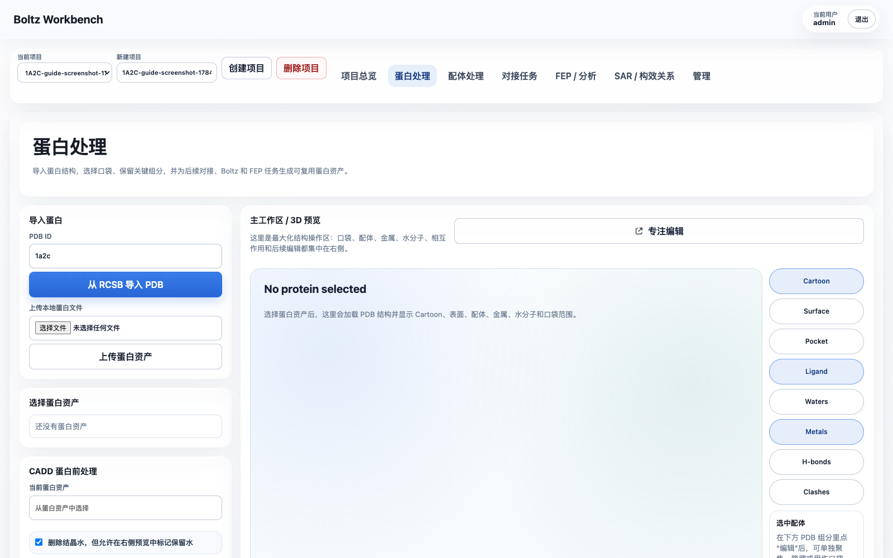
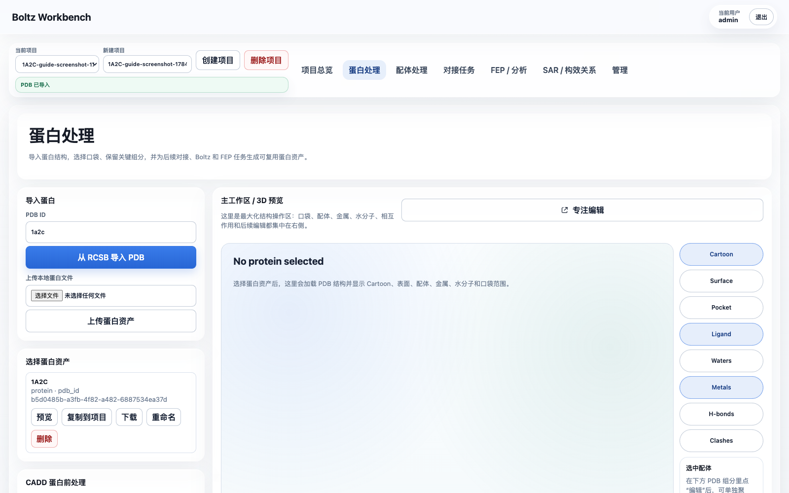
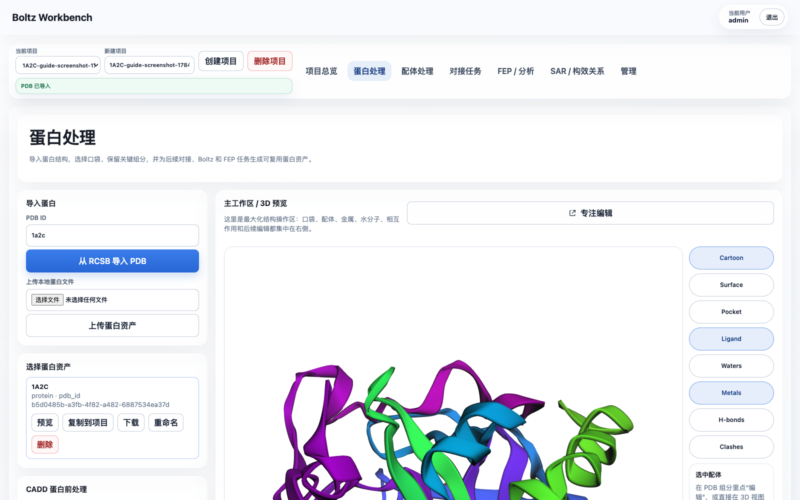
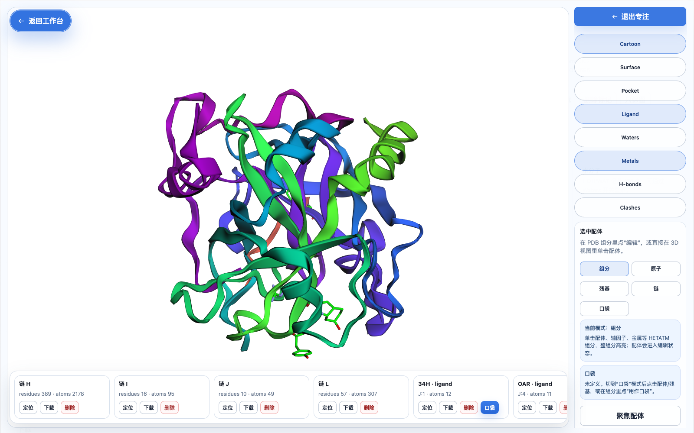
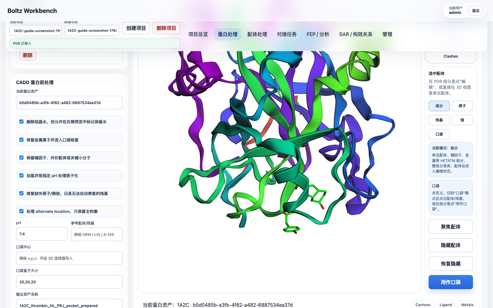
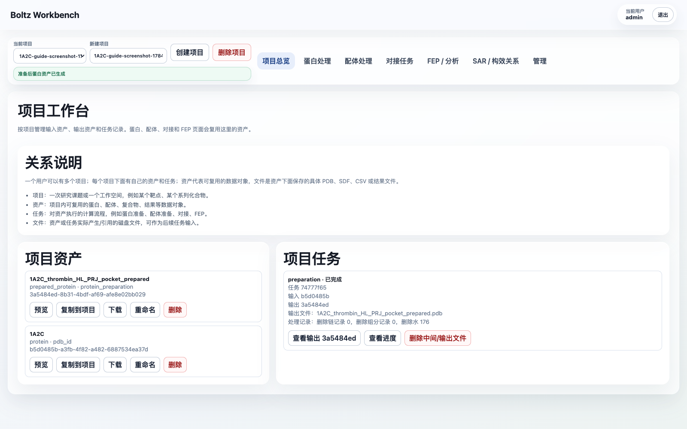

# 1A2C 蛋白准备网页端操作指南 / 1A2C Protein Preparation Web Guide

本文以 PDB `1A2C` 为例，说明在 Boltz Workbench 网页端如何选择参考配体、定义口袋、完成蛋白准备，并把准备后的文件作为后续对接任务输入。

This guide uses PDB `1A2C` as an example. It explains how to choose the reference ligand, define a docking pocket, run protein preparation in Boltz Workbench, and reuse the prepared receptor and pocket in downstream docking or Boltz workflows.

## English quick path

1. Log in as `admin / admin123456`.
2. Create a project such as `1A2C-thrombin-demo`.
3. Open `Protein Preparation`, import PDB ID `1a2c`, and preview the imported protein asset.
4. In the PDB component list, use `PRJ J:3` as the pocket reference. It sits in the middle of the Aeruginosin 298-A inhibitor chain.
5. Set the pocket center to approximately `18.54, -14.79, 20.56` and start with a `20, 20, 20 Å` box. Increase to `22, 22, 22 Å` if you want to cover the full inhibitor chain more conservatively.
6. Keep thrombin chains `H/L`; remove the original inhibitor chain `J` before preparing the receptor. Remove hirudin chain `I` if the task is ordinary small-molecule docking against thrombin.
7. Keep `NA H:626` unless your downstream method requires all ions removed. Remove crystallographic waters by default.
8. Run protein preparation and use the generated `prepared_protein` asset plus the `pocket` asset in the docking or Boltz input page.

## 1. 这个结构该选哪个配体

`1A2C` 是凝血酶 thrombin 与抑制剂 Aeruginosin 298-A 的复合物。PDB 文件里这个抑制剂不是一个单独的三字母配体，而是链 `J`：

```text
chain J: 34H J:1 + LEU J:2 + PRJ J:3 + OAR J:4
```

网页端的 PDB 组分列表会把其中的 HETATM 组分拆开显示：

| 组分 | 类型 | 是否建议用于对接口袋 |
| --- | --- | --- |
| `34H J:1` | Aeruginosin 片段 | 可辅助确认口袋边界 |
| `PRJ J:3` | Aeruginosin 中部片段 | 推荐作为网页端口袋中心参考 |
| `OAR J:4` | Aeruginosin 端部胍基片段 | 可辅助确认口袋边界 |
| `TYS I:363` | Hirudin 链 I 的磺酸化酪氨酸 | 不建议作为小分子对接口袋 |
| `NA H:626` | 钠离子 | 保留，不作为小分子口袋中心 |
| `HOH/WAT` | 结晶水 | 默认删除，除非需要保留关键水 |

推荐做法：

- 生物学上的参考配体：使用整条 `chain J`，即 Aeruginosin 298-A。
- 当前网页端“用作口袋”的单组分参考：选择 `PRJ J:3`。
- 口袋中心推荐起点：`18.54, -14.79, 20.56`。
- 口袋 box 推荐起点：`20, 20, 20 Å`。

原因：`PRJ J:3` 位于链 J 抑制剂的中部，用它作为中心并把 box 调到约 `20 Å`，可以覆盖 `34H/LEU/PRJ/OAR` 整条抑制剂所在结合区域。不要用 `TYS I:363` 定义小分子对接口袋；它属于 hirudin 片段，不是本例要替换或复现的小分子配体。

## 2. 网页端导入 1A2C

1. 打开 Boltz Workbench。
2. 登录：
   - 用户名：`admin`
   - 密码：`admin123456`
3. 进入 `项目总览`。
4. 新建一个项目，例如：
   - `1A2C-thrombin-demo`
5. 进入 `蛋白处理` 页面。
6. 在 `从 RCSB 导入 PDB` 输入：
   - `1a2c`
7. 点击 `从 RCSB 导入 PDB`。
8. 在左侧 `选择蛋白资产` 里点击新导入的 `1A2C`，再点 `预览`。

导入前页面如下：



导入完成后，左侧会出现 `1A2C` 蛋白资产：



右侧 3D 工作区应显示蛋白结构，并能看到链、配体、水、金属等对象。



## 3. 选择参考配体并定义口袋

1. 在 `蛋白处理` 页面右侧点击 `专注编辑`。
2. 在专注编辑窗口右侧选择模式：
   - 推荐先使用 `组分` 模式。
3. 在底部横向对象条里找到：
   - `PRJ · ligand · J:3`
4. 点击 `PRJ J:3` 对象卡片，或在 3D 视图里点击对应配体片段。
5. 点击 `用作口袋`。

专注编辑窗口中，底部横向对象条会列出蛋白链、配体、金属、水等 PDB 对象：


6. 打开 `Pocket` 显示开关，确认 3D 视图里出现蓝色口袋 box。
7. 在右侧口袋参数中把 box 调整为：
   - `SX = 20`
   - `SY = 20`
   - `SZ = 20`
8. 如果需要更保守覆盖整条链 J，可用：
   - `SX = 22`
   - `SY = 22`
   - `SZ = 22`
9. 调整时观察蓝色 box 是否覆盖 `34H/LEU/PRJ/OAR` 所在区域。
10. 点击 `创建口袋资产`。

选择 `PRJ J:3` 后，用它作为口袋参考：



创建后，这个口袋资产会出现在项目资产里，并会自动填入后续对接任务的口袋输入。

## 4. 准备蛋白时该删什么、保留什么

本例推荐参数：

| 项目 | 建议 |
| --- | --- |
| 水分子 | 默认删除 |
| 金属离子 `NA H:626` | 保留 |
| 辅因子/关键 HETATM | 保留，除非明确知道不需要 |
| 参考抑制剂链 `J` | 如果准备用 Boltz/对接重放配体，应从受体里删除 |
| Hirudin 链 `I` | 视研究目的决定；如果只做 thrombin 小分子口袋，建议删除 |
| Thrombin 链 `H/L` | 保留 |

推荐的受体准备策略：

- 保留 thrombin 的 `H` 链和 `L` 链。
- 删除 `J` 链，因为它是原始共晶抑制剂，不应留在待对接受体里。
- 如果目标是普通小分子对接，也删除 `I` 链 hirudin 片段，避免它占据外位点并影响口袋环境判断。
- 保留 `NA` 金属离子，除非后续方法明确要求去除所有离子。
- 删除水分子作为默认起点；若后续发现某些水参与关键作用，再单独保留关键水。

网页端操作：

1. 在专注编辑窗口底部对象条找到 `chain J`。
2. 点击 `删除`，把原始抑制剂链 J 加入删除列表。
3. 如果本次任务只研究 thrombin 小分子口袋，也找到 `chain I`，点击 `删除`。
4. 退出专注编辑，回到 `蛋白处理`。
5. 在 `CADD 蛋白前处理` 区域确认：
   - 删除结构水：勾选。
   - 保留金属离子：勾选。
   - 保留辅因子、共价配体或关键小分子：按研究目的选择；本例如果已经删除链 J，可以保持勾选。
   - pH：`7.4`。
6. 输出名称建议填写：
   - `1A2C_thrombin_HL_PRJ_pocket_prepared`

准备参数确认页面：



## 5. 执行蛋白准备任务

1. 在 `当前蛋白资产` 确认选择的是原始 `1A2C` 资产。
2. 确认口袋参数已经填入，box 为 `20, 20, 20 Å` 或你手动调整后的值。
3. 点击 `准备蛋白`。
4. 到 `项目总览` 或当前页面的任务列表查看任务。

任务应显示：

- `queued`
- `running`
- `completed`

完成后会生成一个新的 `prepared_protein` 资产。

任务完成后，可以在项目总览看到任务卡片和输出资产：



## 6. 查看、下载和复用输出

准备完成后：

1. 在任务卡片里点击 `查看输出`。
2. 在输出资产页面确认：
   - 类型：`prepared_protein`
   - 文件：准备后的 `.pdb`
   - 元数据：包含删除水、删除链、口袋参数和处理统计。
3. 点击 `下载` 可下载准备后的 PDB。
4. 后续 `对接任务` 页面里选择这个 `prepared_protein` 作为蛋白输入。
5. 如果另一个项目也要使用它，点击资产卡片里的 `复制到项目`，输入目标项目 ID，并给复制后的资产重新命名。

## 7. 失败任务怎么处理

如果任务失败：

1. 在任务卡片里点击 `查看进度`，先看错误信息。
2. 如果任务已经生成了部分输出，点击 `删除中间/输出文件`。
3. 修改参数后点击 `继续/重跑`。
4. 重跑后会生成新的输出资产，原任务记录会保留，方便追踪。

## 8. 当前实现边界

当前网页端已经能完成可追踪的 PDB 文本级准备：

- 删除指定链。
- 删除指定 HETATM 组分。
- 删除水分子。
- 生成可下载、可复用、可复制到其他项目的 `prepared_protein` 资产。
- 记录任务状态、进度事件、输出文件和清理统计。

当前还没有真正执行以下化学准备步骤：

- 加氢。
- pH 相关质子化。
- 缺失原子/缺失残基修复。
- alternate location 的构象选择。

这些步骤会记录在任务元数据的 `unsupported_operations` 里，后续需要接入 PDBFixer/OpenMM、PropKa/PDB2PQR、Reduce 或同类 worker 后再执行。
